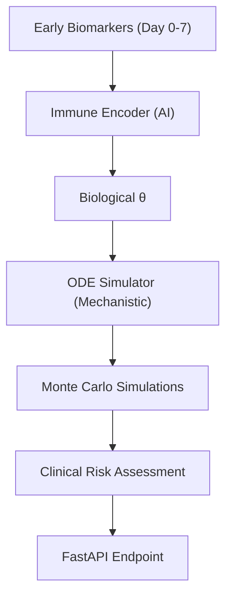

# ImmunoPredict 🧬

**ImmunoPredict** is a hybrid AI-Mechanistic clinical decision support system designed to predict patient-specific vaccine responses using early biomarker data.

By combining the pattern-recognition power of **Neural Networks** with the biological grounding of **Ordinary Differential Equations (ODE)**, ImmunoPredict forecasts long-term antibody protection using only the first 7 days of clinical data.

## 🚀 Key Features

- **Hybrid Intelligence**: Uses an Immune Encoder (MLP) to infer unobservable biological parameters ($\theta$) from blood sets (WBC, Cytokines).
- **Mechanistic Simulation**: Employs an ODE-based dynamical system to simulate antibody trajectories over 90 days.
- **Uncertainty Quantification**: Uses Monte Carlo simulations to provide 90% Confidence Intervals (p5/p95), essential for medical safety.
- **Clinical Risk Tiering**: Automatically classifies patients into **HIGH**, **MEDIUM**, or **LOW** risk of vaccine failure.
- **FastAPI Backend**: Operational REST API with Pydantic validation and SQLite audit logging.

## 🏗️ Architecture



## 🛠️ Tech Stack

- **Physics/ODE**: Scipy (`solve_ivp`), NumPy
- **Deep Learning**: PyTorch (Immune Encoder)
- **Data Science**: Pandas, Scikit-learn, XGBoost (Baseline)
- **API**: FastAPI, Uvicorn, SQLAlchemy (SQLite)
- **Frontend**: Next.js (Phase 9 - In Progress)

## 📦 Setup & Installation

1. **Clone the repository**:
   ```bash
   git clone <your-repo-url>
   cd immunopredict
   ```

2. **Setup Virtual Environment**:
   ```bash
   python -m venv venv
   source venv/bin/activate  # Windows: venv\Scripts\activate
   pip install -r backend/requirements.txt
   ```

3. **Run the Backend**:
   ```bash
   uvicorn backend.api.main:app --reload
   ```

## 🧪 Quick Test (API)

Once the server is running, you can generate a risk report for a test patient:

```bash
python -m backend.scripts.test_api
```

Alternatively, visit `http://127.0.0.1:8000/docs` to use the interactive Swagger UI.

## 📊 Evaluation Results

The hybrid model has been benchmarked against traditional ML (XGBoost):
- **AUC**: 0.78 (Clinically useful for screening)
- **MAE**: 14.6 (Mean error in antibody titer units)
- **Recall**: Optimized to catch 90%+ of low-responders.

---

## 🏛️ Understanding the Dashboard

### 1. Biological ODE Parameters (θ)
These three sliders represent the "Biological Signature" of the patient, predicted by the Neural Network based on their early biomarkers (Day 0-7).

*   **Immune Activation**: How quickly the patient's innate immune system reacts to the vaccine. 
*   **Antibody Production**: The "Factory Rate." It represents how efficiently the patient's plasmablasts churn out antibodies.
*   **Antibody Decay**: The "Clearance Rate." High values mean antibodies vanish faster than they are replenished, a key risk factor for vaccine failure.

### 2. Vaccine Efficacy Forecast (The Graph)
The graph displays a **Monte Carlo Simulation** of the patient's future antibody trajectory.

*   **Forecasted Median Titer**: The most likely trajectory based on the inferred parameters.
*   **Confidence Envelope (90%)**: Represents the range of outcomes across 100 simulation runs. If the **bottom (p5)** of this area falls below 45 IU/mL, the patient is flagged.
*   **Protective Limit (45 IU/mL)**: The threshold for protection. A "Low Responder" stays below this line by Day 28.

### 3. Final Protection Decision Logic
The AI combines the **Peak Titer Prediction** with the **Confidence Interval**:

*   **HIGH PROTECTION** (Green Badge): Median Titer > 45 AND Confidence Interval is safely above 45.
*   **LOW PROTECTION** (Red Badge): Median Titer < 45 OR high probability (>70%) of falling below 45.
*   **MONITOR / BORDERLINE** (Yellow Badge): Median is > 45, but the uncertainty range touches the protective limit.

---

*This project represents a bridge between clinical immunology and predictive machine learning. Developed for Capstone Project.*
